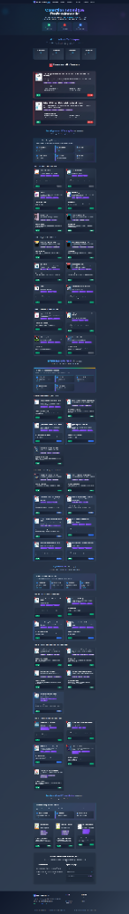

# 📚 Collection Technique Professionnelle

[](https://nodejs.org/)
[](https://vite.dev/)
[](https://tailwindcss.com/)
[](#)
[](#)

Cette application interactive est un tableau de bord et guide d'apprentissage structuré pour une collection technique professionnelle composée de 50 ouvrages spécialisés. Elle s'organise autour de 4 grands domaines : Développement, Infrastructure, Cybersécurité et Transmission (Pédagogie).

> [!WARNING]  
> **Statut du projet :** Ce projet n'est pas à jour et ne permet pas en l'état d'ajouter du contenu. Aucun backend n'a été créé à ce jour. L'interface fonctionne actuellement avec des données statiques locales.

---

## 🛠️ Stack Technique & Prérequis

- **Runtime :** Node.js v22 (Requis obligatoirement)
- **Bundler / Serveur Dev :** ViteJS v6
- **CSS Framework :** Tailwind CSS v4 (intégré via le nouveau plugin Vite natif et configuré directement en variables CSS)
- **Structure & Logiciels :** HTML5 sémantique et JavaScript Vanilla pour l'interactivité (gestion des états actifs et navigation fluide).

---

## 🚀 Démarrage Rapide

### 1. Installation des dépendances

Pour installer les modules requis (Vite et Tailwind CSS v4) :

```bash
npm install
```

### 2. Lancement du serveur de développement

Pour démarrer le serveur de développement local sur le port `3000` :

```bash
npm run dev
```

### 3. Build de production

Pour compiler l'application de façon optimisée pour la production :

```bash
npm run build
```

---

## 📂 Structure du Projet

- `index.html` : Structure de l'application et gestion sémantique.
- `src/style.css` : Feuille de style principale intégrant Tailwind CSS v4 et les classes d'effets visuels personnalisées (glassmorphism, animations float/glow, dégradés complexes).
- `images/` : Couvertures des 50 ouvrages techniques de la collection.
- `vite.config.js` : Configuration de ViteJS avec le plugin Tailwind CSS v4 et mécanisme d'intégration automatique de la capture d'aperçu.

---

## 📸 Aperçu de l'Interface

Voici le rendu de l'interface utilisateur de l'application :


